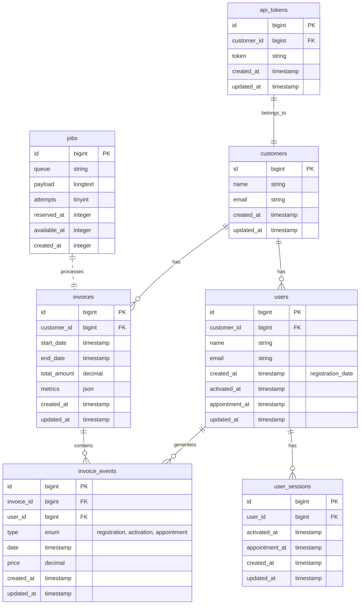

# Invoicing API

A Laravel-based REST API for managing customer invoices based on user events. The system calculates charges based on the most expensive event per user within a billing period.

## Database Diagram



### Table Relationships

1. **Customers**
   - One-to-Many with Users
   - One-to-Many with Invoices
   - One-to-One with ApiToken
   - Primary entity storing customer information

2. **Users**
   - Belongs-to Customer
   - One-to-Many with InvoiceEvents
   - One-to-Many with UserSessions
   - Stores user events (registration, activation, appointment)

3. **UserSessions**
   - Belongs-to User
   - Tracks individual activation and appointment sessions
   - Maintains history of user activities
   - Allows multiple sessions per user

4. **Invoices**
   - Belongs-to Customer
   - One-to-Many with InvoiceEvents
   - Contains billing period and total amount

5. **InvoiceEvents**
   - Belongs-to Invoice
   - Belongs-to User
   - Records individual billable events

6. **ApiTokens**
   - Belongs-to Customer
   - Handles authentication
   - One token per customer

7. **Jobs**
   - Queue table for async operations
   - Handles email notifications
   - Processes background tasks

### Key Features

- **Event Tracking**: 
  - User table timestamps track initial registration
  - UserSessions track multiple activations and appointments
  - Detailed session history per user
- **Billing Logic**: 
  - Invoice events store individual charges with their types and amounts
  - Considers all sessions within billing period
  - Charges highest-priced event per user
- **Metrics Storage**: 
  - Invoices store metrics in JSON format for flexibility
  - Tracks total, active, and registered users
  - Maintains appointment statistics
- **Queue System**: 
  - Jobs table manages asynchronous tasks
  - Handles email notifications
  - Ensures reliable background processing
- **Security**: 
  - API tokens provide secure authentication per customer
  - Session-based activity tracking
  - Proper data relationships and constraints

## Features

- Create invoices for customers based on user events
- Calculate invoice amounts based on different event types:
  - Registration: 100 SAR
  - Activation: 50 SAR
  - Appointment: 200 SAR
- Intelligent billing logic:
  - Charges only the most expensive event per user
  - Only charges events within the specified date range
  - Handles multiple events per user correctly
- User event tracking:
  - Registration dates (one-time)
  - Multiple activation sessions
  - Multiple appointment sessions
- Session management:
  - Track multiple activations per user
  - Track multiple appointments per user
  - Historical session data
- Comprehensive metrics:
  - Total users
  - Active users
  - Registered users
  - Appointment users
- Token-based authentication
- Detailed invoice reporting
- Email notifications for generated invoices
- Queue system for handling notifications

## Event Pricing

- Registration: 100 SAR
- Activation: 50 SAR
- Appointment: 200 SAR

*Note: Only the most expensive event per user is charged within a billing period.*

## API Endpoints

### Create Invoice
```http
POST /api/v1/invoices
Authorization: Bearer your-api-token
```

**Request Body:**
```json
{
    "customer_id": 1,
    "start_date": "2024-01-01",
    "end_date": "2024-01-31"
}
```

**Response:**
```json
{
    "message": "Invoice created successfully",
    "invoice_id": 1
}
```

### Get Invoice Details
```http
GET /api/v1/invoices/{invoice_id}
Authorization: Bearer your-api-token
```

**Response:**
```json
{
    "invoice_id": 1,
    "customer_id": 1,
    "period": {
        "start": "2024-01-01T00:00:00.000000Z",
        "end": "2024-01-31T23:59:59.999999Z"
    },
    "events": [
        {
            "type": "registration",
            "date": "2024-01-15T10:00:00.000000Z",
            "price": "100.00",
            "user_id": 1
        },
        {
            "type": "activation",
            "date": "2024-01-20T14:30:00.000000Z",
            "price": "50.00",
            "user_id": 1
        },
        {
            "type": "appointment",
            "date": "2024-01-25T09:15:00.000000Z",
            "price": "200.00",
            "user_id": 1
        }
    ],
    "event_frequency": {
        "registration": 1,
        "activation": 1,
        "appointment": 1
    },
    "price_per_event": {
        "registration": 100,
        "activation": 50,
        "appointment": 200
    },
    "total_amount": "200.00",
    "user_details": [
        {
            "user_id": 1,
            "email": "user@example.com",
            "name": "John Doe",
            "events": [
                {
                    "type": "registration",
                    "date": "2024-01-15T10:00:00.000000Z",
                    "price": "100.00"
                },
                {
                    "type": "activation",
                    "date": "2024-01-20T14:30:00.000000Z",
                    "price": "50.00"
                },
                {
                    "type": "appointment",
                    "date": "2024-01-25T09:15:00.000000Z",
                    "price": "200.00"
                }
            ],
            "sessions": [
                {
                    "id": 1,
                    "activation_date": "2024-01-20T14:30:00.000000Z",
                    "appointment_date": null
                },
                {
                    "id": 2,
                    "activation_date": "2024-01-22T16:45:00.000000Z",
                    "appointment_date": null
                },
                {
                    "id": 3,
                    "activation_date": null,
                    "appointment_date": "2024-01-25T09:15:00.000000Z"
                }
            ]
        }
    ],
    "user_metrics": {
        "total_users": 1,
        "active_users": 1,
        "registered_users": 1,
        "appointment_users": 1
    }
}
```

## Authentication

The API uses token-based authentication. Include your API token in the request headers:

```http
Authorization: Bearer your-api-token
```

## Error Responses

```json
{
    "error": "Error message",
    "code": "ERROR_CODE"
}
```

Common error codes:
- `INVALID_DATES`: Invalid date range provided
- `CUSTOMER_NOT_FOUND`: Customer ID does not exist
- `UNAUTHORIZED`: Invalid or missing API token

## Installation

1. Clone the repository:
```bash
git clone git@github.com:ahmeddhamdallah/invoicing-api.git
cd invoicing-api
```

2. Install dependencies:
```bash
composer install
```

3. Set up environment:
```bash
cp .env.example .env
php artisan key:generate
```

4. Configure database in `.env`:
```
DB_CONNECTION=mysql
DB_HOST=127.0.0.1
DB_PORT=3306
DB_DATABASE=invoicing
DB_USERNAME=your_username
DB_PASSWORD=your_password
```

5. Configure mail settings in `.env`:
```
MAIL_MAILER=smtp
MAIL_HOST=your_smtp_host
MAIL_PORT=587
MAIL_USERNAME=your_username
MAIL_PASSWORD=your_password
MAIL_ENCRYPTION=tls
MAIL_FROM_ADDRESS=your_from_address
MAIL_FROM_NAME="${APP_NAME}"
```

6. Configure queue in `.env`:
```
QUEUE_CONNECTION=database
```

7. Run migrations and seed test data:
```bash
php artisan migrate:fresh --seed --seeder=TestDataSeeder
```

8. Start the queue worker:
```bash
php artisan queue:work
```

The seeder will:
- Create a test customer
- Create test users with various scenarios
- Generate and display your API token
- Show test scenarios and expected charges

## Email Notifications

The system automatically sends email notifications when:
- A new invoice is generated
- The notification includes:
  - Invoice period
  - Total amount
  - Link to view invoice details
- Notifications are queued for better performance

## Queue System

The application uses Laravel's queue system to handle:
- Email notifications
- Background job processing
- Improved performance for long-running tasks

To ensure notifications are sent:
1. Make sure the queue worker is running
2. Monitor the jobs table for failed jobs
3. Set up supervisor for production environments

## Testing

The API includes comprehensive test coverage. To run the tests:

```bash
php artisan test
```

This will run:
- Unit tests for the invoice service
- Unit tests for the token guard
- Tests for all billing scenarios:
  - Registration only
  - Activation only
  - Appointment only
  - Multiple events (highest price charged)
  - Events outside billing period

## Example Scenarios

The test data includes several scenarios:

1. User A: Registered before period, activated during period
   - Should be charged 50 SAR for activation
   - Previous registration not charged (outside period)

2. User B: Registered before period, made appointment during period
   - Should be charged 200 SAR for appointment
   - Previous registration not charged (outside period)

3. User C: Multiple events during period
   - Registration (100 SAR)
   - Activation (50 SAR)
   - Appointment (200 SAR)
   - Should be charged 200 SAR (highest price only)

4. User D: All events before period
   - Should not be charged (0 SAR)
   - All events outside billing period

## License

This project is open-sourced software licensed under the [MIT license](https://opensource.org/licenses/MIT).
